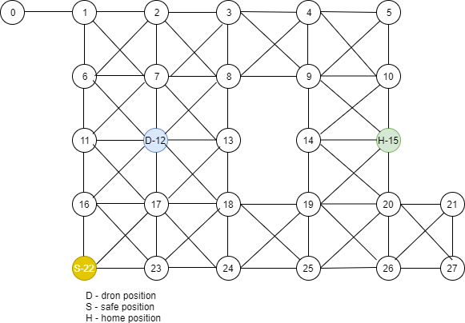

# Easy Aerial Task

Dijkstra algorithm for finding shortest path to safe nodes.
This graph is for representative example. Feel free to change graph or / and  positions.
Console will print out solution.

---
## Requirements

For development, you will only need Node.js and a node global package installed in your environment.

## Running the project
    $ node path-finder.js

## Graph

